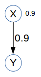

  
<link rel="stylesheet" href="http://web.stanford.edu/~erindb/webppl-viz/viz.css">

* toc
{:toc}

## Causal Bayes Nets vs Functional Causal Models

Lucas & Kemp 2015 find evidence that *Functional Causal Models* rather than *Causal Bayes Nets* accurately reflect people's intuitions about cause and counterfactuals.

### Causal Bayes Nets

A *Causal Bayes Net* (CBN) assumes that causal relationships can be inherently stochastic.

~~~
var BCN = function() {
  var X = flip(0.9);
  var Y = flip(0.9) ? X : false;
  return { X: X, Y: Y };
}
vizPrint(Enumerate(BCN));
~~~

### Functional Causal Models

A *Functional Causal Model* (FCM) assumes that all causes are actually determinisitic, but some are unknown. Every observable variable $$X$$ is a deterministic function of its parent observable variables $$par(X)$$ and an exogenous random variable $$U_{X}$$. The randomness of the system lies in the unobserved and unobservable variables $$U_{X}$$.

~~~
// the causal relationships are deterministic
var X = function(Ux, Uy) {return Ux;};
var Y = function(Ux, Uy) {return and(X(Ux, Uy), Uy)};

// but other factors are at play that we have uncertainty about
var FCM = function() {
  var Ux = flip(0.9);
  var Uy = flip(0.9);
  return { X: X(Ux, Uy), Y: Y(Ux, Uy) };
}

vizPrint(Enumerate(FCM));
~~~

### Bacon Example

~~~
// the causal relationships are deterministic
// functions of the random state U
var model = {
  bacon: function(U) {
    return U.bacon;
  },
  smokeAlarm: function(U, m) {
    // smokeAlarm needs to look up how to compute
    // bacon under the model, so it takes model m as
    // a parameter
    var baconFn = m.bacon;
    var bacon = baconFn(U, m);
    return and(bacon, U.smokeAlarm);
  },
  neighbors: function(U, m) {
    var smokeAlarmFn = m.smokeAlarm;
    var smokeAlarm = smokeAlarmFn(U, m);
    return or(smokeAlarm, U.neighbors);
  }
}

// for pretty printing
var world_to_string = function(world) {
  return (world.bacon?"B":"-") + (world.smokeAlarm?"S":"-") + 
    (world.neighbors?"N":"-");
}

var baconFCM = function() {
  // other factors are at play that we have uncertainty about
  var U = {
    bacon: flip(0.9), //I'm probably going to make bacon
    smokeAlarm: flip(0.9), //The smoke alarm might not notice the bacon
    neighbors: flip(0.1) //The neighbors might be upset for some other reason
  };
  
  // because webppl doesn't support calling anonymous functions
  // especially well
  var baconFn = model.bacon;
  var smokeAlarmFn = model.smokeAlarm;
  var neighborsFn = model.neighbors;
  
  var world = {
    bacon: baconFn(U, model),
    smokeAlarm: smokeAlarmFn(U, model),
    neighbors: neighborsFn(U, model)
  };
  
  return world_to_string(world);
};

print(Enumerate(baconFCM));
~~~

## Models of counterfactuals

### Structural Model

~~~
// the causal relationships are deterministic
// functions of the random state U
var actualModel = {
  bacon: function(U) {
    return U.bacon;
  },
  smokeAlarm: function(U, m) {
    // smokeAlarm needs to look up how to compute
    // bacon under the model, so it takes model m as
    // a parameter
    var baconFn = m.bacon;
    var bacon = baconFn(U, m);
    return and(bacon, U.smokeAlarm);
  },
  neighbors: function(U, m) {
    var smokeAlarmFn = m.smokeAlarm;
    var smokeAlarm = smokeAlarmFn(U, m);
    return or(smokeAlarm, U.neighbors);
  }
}

// wrap a value in a function,
// for endogenous variables that get fixed by intervention
var intervene = function(x) {return function() {return x;};};

// for pretty printing
var world_to_string = function(world) {
  return (world.bacon?"B":"-") + (world.smokeAlarm?"S":"-") + 
    (world.neighbors?"N":"-");
}

var SM = function(prem, observations) {
  return function() {
    // state of exogenous variables
    // under SM, actual and counterfactual exogenous variables are the same
    var U = {
      bacon: flip(0.9), //I'm probably going to make bacon
      smokeAlarm: flip(0.9), //The smoke alarm might not notice the bacon
      neighbors: flip(0.1) //The neighbors might be upset for some other reason
    };

    // actual model functions re-written
    // because webppl doesn't support calling anonymous functions
    // especially well
    var actualBaconFn = actualModel.bacon;
    var actualSmokeAlarmFn = actualModel.smokeAlarm;
    var actualNeighborsFn = actualModel.neighbors;

    // build actual world, based on actualModel and U
    var actualWorld = {
      bacon: actualBaconFn(U, actualModel),
      smokeAlarm: actualSmokeAlarmFn(U, actualModel),
      neighbors: actualNeighborsFn(U, actualModel)
    };

    // condition actual world on observations
    map(function(obs) {
      var fn = actualModel[obs.variable];
      var actualValue = fn(U, actualModel);
      condition( actualValue == obs.value );
    }, observations);

    // build counterfactual model, based on premises
    var counterfactualModel = {
      bacon: (prem.bacon == undefined) ? actualModel.bacon : intervene(prem.bacon),
      smokeAlarm: (prem.smokeAlarm == undefined) ? actualModel.smokeAlarm : intervene(prem.smokeAlarm),
      neighbors: (prem.neighbors == undefined) ? actualModel.neighbors : intervene(prem.neighbors)
    };

    //counterfactual model functions
    // because webppl doesn't support calling anonymous functions
    // especially well
    var counterfactualBaconFn = counterfactualModel.bacon;
    var counterfactualSmokeAlarmFn = counterfactualModel.smokeAlarm;
    var counterfactualNeighborsFn = counterfactualModel.neighbors;

    // build counterfactual world, based on counterfactualModel and U
    // build actual world, based on actualModel and U
    var counterfactualWorld = {
      bacon: counterfactualBaconFn(U, counterfactualModel),
      smokeAlarm: counterfactualSmokeAlarmFn(U, counterfactualModel),
      neighbors: counterfactualNeighborsFn(U, counterfactualModel)
    };

    return world_to_string(counterfactualWorld);
  };
};

print(Enumerate(SM(
  { // counterfactual premise
    smokeAlarm: false
  },
  [
    // actual observations
    { variable:"bacon", value: true },
    { variable:"smokeAlarm", value: true },
    { variable:"neighbors", value: true },
  ])));
~~~

### Extended Structural Model

~~~
// the causal relationships are deterministic
// functions of the random state U
var model = {
  bacon: function(U) {
    return U.bacon;
  },
  smokeAlarm: function(U, m) {
    // smokeAlarm needs to look up how to compute
    // bacon under the model, so it takes model m as
    // a parameter
    var baconFn = m.bacon;
    var bacon = baconFn(U, m);
    return and(bacon, U.smokeAlarm);
  },
  neighbors: function(U, m) {
    var smokeAlarmFn = m.smokeAlarm;
    var smokeAlarm = smokeAlarmFn(U, m);
    return or(smokeAlarm, U.neighbors);
  }
}

// for pretty printing
var world_to_string = function(world) {
  return (world.bacon?"B":"-") + (world.smokeAlarm?"S":"-") + 
    (world.neighbors?"N":"-");
}

var baconPrior = function() {return flip(0.9);};
var smokeAlarmPrior = function() {return flip(0.9);};
var neighborsPrior = function() {return flip(0.1);};

var ESM = function(premises, stability, observations) {
  return function() {
    // state of exogenous variables
    // under SM, actual and counterfactual exogenous variables are the same
    var actualU = {
      bacon: baconPrior(),
      smokeAlarm: smokeAlarmPrior(),
      neighbors: neighborsPrior()
    };
    var counterfactualU = {
      bacon: flip(stability) ? actualU.bacon : baconPrior(),
      smokeAlarm: flip(stability) ? actualU.smokeAlarm : smokeAlarmPrior(),
      neighbors: flip(stability) ? actualU.neighbors : neighborsPrior()
    }

    // model functions re-written
    // because webppl doesn't support calling anonymous functions
    // especially well
    var baconFn = model.bacon;
    var smokeAlarmFn = model.smokeAlarm;
    var neighborsFn = model.neighbors;

    // build actual world, based on model and actualU
    var actualWorld = {
      bacon: baconFn(actualU, model),
      smokeAlarm: smokeAlarmFn(actualU, model),
      neighbors: neighborsFn(actualU, model)
    };

    // condition actual world on observations
    map(function(obs) {
      var fn = model[obs.variable];
      var actualValue = fn(actualU, model);
      condition( actualValue == obs.value );
    }, observations);

    // build counterfactual world, based on model
    // and counterfactualU
    var counterfactualWorld = {
      bacon: baconFn(counterfactualU, model),
      smokeAlarm: smokeAlarmFn(counterfactualU, model),
      neighbors: neighborsFn(counterfactualU, model)
    };

    // condition counterfactual world on premises
    map(function(prem) {
      var fn = model[prem.variable];
      var counterfactualValue = fn(counterfactualU, model);
      condition( counterfactualValue == prem.value );
    }, premises);

    return counterfactualWorld;
  };
};

var fullERP = Enumerate(ESM(
  [{ variable: "smokeAlarm", value: false }],
  0.5,
  [
    { variable: "bacon", value: true },
    { variable: "smokeAlarm", value: true },
    { variable: "neighbors", value: true }
  ]));

var baconERP = Enumerate(function() {
  return sample(fullERP).bacon;
})
Math.exp(baconERP.score([], true));
// from page 7 of Lucas&Kemp2015

var stringERP = Enumerate(function() {
  return world_to_string(sample(fullERP));
});
print(stringERP);
~~~

### ESM with intervention

~~~
// the causal relationships are deterministic
// functions of the random state U
var actualModel = {
  bacon: function(U) {
    return U.bacon;
  },
  smokeAlarm: function(U, m) {
    // smokeAlarm needs to look up how to compute
    // bacon under the model, so it takes model m as
    // a parameter
    var baconFn = m.bacon;
    var bacon = baconFn(U, m);
    return and(bacon, U.smokeAlarm);
  },
  neighbors: function(U, m) {
    var smokeAlarmFn = m.smokeAlarm;
    var smokeAlarm = smokeAlarmFn(U, m);
    return or(smokeAlarm, U.neighbors);
  }
}

// wrap a value in a function,
// for endogenous variables that get fixed by intervention
var intervene = function(x) {return function() {return x;};};

// for pretty printing
var world_to_string = function(world) {
  return (world.bacon?"B":"-") + (world.smokeAlarm?"S":"-") + 
    (world.neighbors?"N":"-");
}

var baconPrior = function() {return flip(0.9);};
var smokeAlarmPrior = function() {return flip(0.9);};
var neighborsPrior = function() {return flip(0.1);};

var ESM_with_interventions = function(interventions, stability, actualObservations, counterfactualObservations) {
  return function() {
    // state of exogenous variables in actual world
    var actualU = {
      bacon: flip(0.9), //I'm probably going to make bacon
      smokeAlarm: flip(0.9), //The smoke alarm might not notice the bacon
      neighbors: flip(0.1) //The neighbors might be upset for some other reason
    };
    // state of exogenous variables in counterfactual world
    var counterfactualU = {
      bacon: flip(stability) ? actualU.bacon : baconPrior(),
      smokeAlarm: flip(stability) ? actualU.smokeAlarm : smokeAlarmPrior(),
      neighbors: flip(stability) ? actualU.neighbors : neighborsPrior()
    }

    // actual model functions re-written
    // because webppl doesn't support calling anonymous functions
    // especially well
    var actualBaconFn = actualModel.bacon;
    var actualSmokeAlarmFn = actualModel.smokeAlarm;
    var actualNeighborsFn = actualModel.neighbors;

    // build actual world, based on actualModel and actualU
    var actualWorld = {
      bacon: actualBaconFn(actualU, actualModel),
      smokeAlarm: actualSmokeAlarmFn(actualU, actualModel),
      neighbors: actualNeighborsFn(actualU, actualModel)
    };

    // condition actual world on actual observations
    map(function(obs) {
      var fn = actualModel[obs.variable];
      var actualValue = fn(actualU, actualModel);
      condition( actualValue == obs.value );
    }, actualObservations);

    // build counterfactual model, based on premises
    var counterfactualModel = {
      bacon: (interventions.bacon == undefined) ? actualModel.bacon : intervene(interventions.bacon),
      smokeAlarm: (interventions.smokeAlarm == undefined) ? actualModel.smokeAlarm : intervene(interventions.smokeAlarm),
      neighbors: (interventions.neighbors == undefined) ? actualModel.neighbors : intervene(interventions.neighbors)
    };

    //counterfactual model functions
    // because webppl doesn't support calling anonymous functions
    // especially well
    var counterfactualBaconFn = counterfactualModel.bacon;
    var counterfactualSmokeAlarmFn = counterfactualModel.smokeAlarm;
    var counterfactualNeighborsFn = counterfactualModel.neighbors;

    // build counterfactual world, based on counterfactualModel and U
    // build actual world, based on actualModel and counterfactualU
    var counterfactualWorld = {
      bacon: counterfactualBaconFn(counterfactualU, counterfactualModel),
      smokeAlarm: counterfactualSmokeAlarmFn(counterfactualU, counterfactualModel),
      neighbors: counterfactualNeighborsFn(counterfactualU, counterfactualModel)
    };

    // condition counterfactual world on counterfactual observations
    map(function(obs) {
      var fn = counterfactualModel[obs.variable];
      var counterfactualValue = fn(counterfactualU, counterfactualModel);
      condition( counterfactualValue == obs.value );
    }, counterfactualObservations);

    return counterfactualWorld;
  };
};

var fullERP = Enumerate(
  ESM_with_interventions(
    { // interventions
      smokeAlarm: false
    },
    0.5, // stability
    [
      // actual observations
      { variable:"bacon", value: true },
      { variable:"smokeAlarm", value: true },
      { variable:"neighbors", value: true }
    ],
    // counterfactual observations
    []
  )
);

var baconERP = Enumerate(function() {
  return sample(fullERP).bacon;
});
print(Math.exp(baconERP.score([], true)));
// intervention counterfactual from page 7 of Lucas&Kemp 2015

var stringERP = Enumerate(function() {
  return world_to_string(sample(fullERP));
});
print(stringERP);
~~~