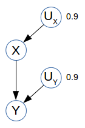
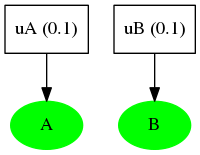
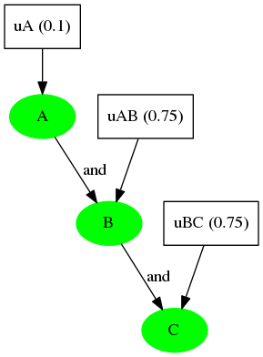
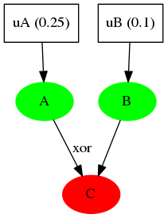
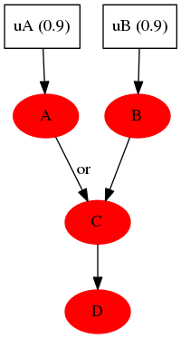
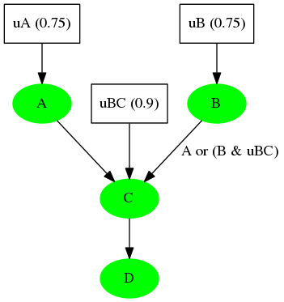
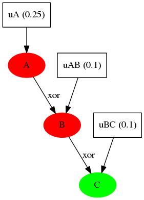
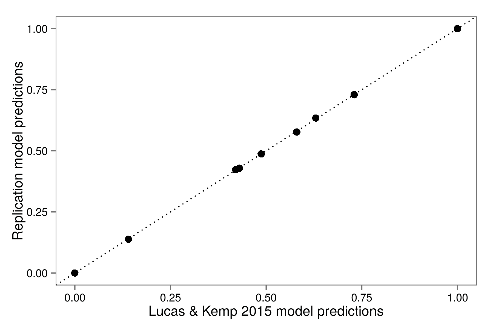
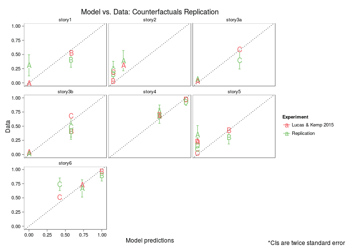

  
<link rel="stylesheet" href="http://web.stanford.edu/~erindb/webppl-viz/viz.css">

* toc
{:toc}

## Representing Causal Knowledge: Causal Bayes Nets vs Functional Causal Models

Lucas & Kemp 2015 find evidence that *Functional Causal Models* rather than *Causal Bayes Nets* accurately reflect people's intuitions about cause and counterfactuals.

### Causal Bayes Nets

A *Causal Bayes Net* (CBN) assumes that causal relationships can be inherently stochastic.

~~~
var BCN = function() {
  var X = flip(0.9);
  var Y = flip(0.9) ? X : false;
  return { X: X, Y: Y };
}
vizPrint(Enumerate(BCN));
~~~

### Functional Causal Models

A *Functional Causal Model* (FCM) assumes that all causes are actually determinisitic, but some are unknown. Every observable variable $$X$$ is a deterministic function of its parent observable variables $$par(X)$$ and an exogenous random variable $$U_{X}$$. The randomness of the system lies in the unobserved and unobservable variables $$U_{X}$$.

~~~
// the causal relationships are deterministic
var X = function(Ux, Uy) {return Ux;};
var Y = function(Ux, Uy) {return and(X(Ux, Uy), Uy)};

// but other factors are at play that we have uncertainty about
var FCM = function() {
  var Ux = flip(0.9);
  var Uy = flip(0.9);
  return { X: X(Ux, Uy), Y: Y(Ux, Uy) };
}

vizPrint(Enumerate(FCM));
~~~

### Example

Suppose we decide to cook bacon, which we often do. The smoke alarm goes off, which it usually does when we cook bacon. Our neighbors get angry, which sometimes happens for other reasons but *definitely* happens when our smoke alarm goes off.

Here's the causal knowledge and random state priors that can represent this story:

~~~
var world2String = function(world) {
  map(function(x) {
    return x[1] ? x[0] : '-';
  }, _.pairs(world)).join('');
};
var strPrint = function(erp) {
  print(Enumerate(function() {
    return world2String(sample(erp));
  }));
  return true;
};
var stories = {
  bacon: {
    //random state priors
    rand : function() {
      return {
        //we will probably cook bacon
        uB: flip(0.9),
        //the smoke alarm is probably working
        uS: flip(0.9),
        //even if the smoke alarm doesn't go off,
        //the neighbors might still be angry for
        //some other reason
        uN: flip(0.1)
      };
    },
    //causal knowledge
    vars: function(rVs) {
      var B = rVs.uB;
      //the smoke alarm will only go off if we're cooking
      //bacon (B) and it's working (uS)
      var S = B & rVs.uS ? true : false;
      //the neighbors will definitely be angry if the smoke
      //alarm goes off. otherwise, they might still be angry
      var N = S | rVs.uN ? true : false;
      return {
        B: B,
        S: S,
        N: N
      };
    }
  }
};
var rand = stories.bacon.rand;
var vars = stories.bacon.vars;
var baconERP = Enumerate(function() {
  var rVs = rand(); //random sate
  var world = vars(rVs); //observable world state
  return world;
});
print('joint distribution');
strPrint(baconERP);
print('marginals');
vizPrint(baconERP);
~~~

## Representing Counterfactual Simulation: Extended Structural Model

## Experiments

#### Basic Experiment Design

##### First slide (my words)

We will give you descriptions of different labs that are studying hormones in rats.

Different labs are studying different hormones, so the hormone that one lab calls "A" will not be the same hormone that another lab calls "A".

##### Subsequent slides

Present short story.

In random order, present questions.

e.g.

> If hormone A were observed to be absent, would hormone A be present?  
> <input type='radio' name='response' value='yes'>Yes  
> <input type='radio' name='response' value='no'>No  
>  
> How confident are you in your answer?  
> <input type='radio' name='confidence' value='1'>Not at all confident  
> <input type='radio' name='confidence' value='2'>  
> <input type='radio' name='confidence' value='3'>  
> <input type='radio' name='confidence' value='4'>  
> <input type='radio' name='confidence' value='5'>  
> <input type='radio' name='confidence' value='5'>Completely confident

L&K converted these ratings to subjective probabilities by treating "Not at all confident" responses as 0.5 and linearly interpolating between 0.5 and either 0 or 1, where the direction of interpolation depended on the answer to the yes/no question.

##### Last slide

To get prior probabilities, at the end of each experiment, L&K asked,

> How many, out of 100 mice, does 'a very small number' correspond to?

and rounded the median to the nearest multiple of 5.

These kinds of questions were included as attention checks:

* If you had observed hormone A to be present, would hormone A be present?

Participants who answered these questions incorrectly were excluded.

### Causal Stories

#### story 1: independent

A and B are *a priori* unlikely and causally unrelated. Both happen to be true in this situation.

#### story 2: causal chain

A is unlikely *a priori*. A usually causes B and B usually causes C. All happen to be true in this situation.

#### story 3: simple cause

A is kind of unlikely *a priori*. A usually causes C (but sometimes B gets in the way).
In this situation, A and B are true but (since B prevents A from causing C) C is false.

#### story 4: multiple causes with same strength

A and B are both likely *a priori*. If either (or both) is true, then C is true. C always causes D.
In this situation, all of the variables (A, B, C, D) happen to be false.

#### story 5: multiple causes with different strengths

A and B are both somewhat likely *a priori*. A always causes C, but in the absense of A B usually causes C. C always causes D.
In this situation, all of the variables happen to be true.

*Note:* We're not sure whether the link between B and C is on in this case, because either way, A would have caused C.

#### story 6: xor causal chain

A is *a priori* kind of unlikely. B is almost always the same as A, but sometimes it's the opposite. C is almost always the same as B, but sometimes it's the opposite. In this situation, A is false and successfully causes B to be false. However, even though B is false, C happens to be true.

### Model

~~~
~~~

L&K used a simple grid search to find parameter values that minimized sum squared error. They considered considered 1000 uniformly spaced parameter values between 0 and 1. Best-fit parameter was s=0.53.

Our model simulations show the same results as Lucas & Kemp 2015. ([caveat](./lucas-kemp-2015-replication.html#embedded-counterfactuals))

### Replication Results

* compare our results to theirs and model predictions to data

## Notes

### Embedded counterfactuals

See writeup of [embedded counterfactuals](./embedded-counterfactuals.html) (same model, but in Church).